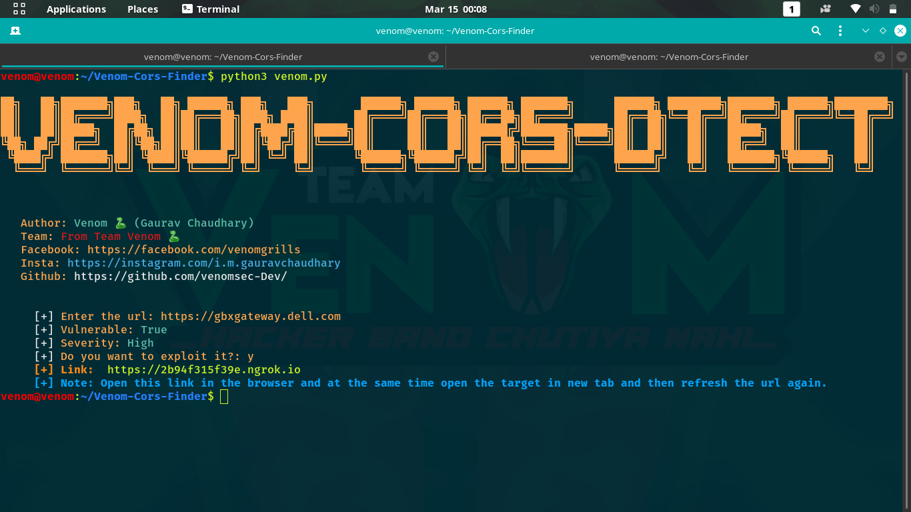

# Venom-CORS-Dtect
This tools detect the basic cors using requests library in python by modifying the headers and later helps you to further exploit the same using poc code for the cors exploitation and hosting it on ngrok server which can further fetch the user data or source code from the session created hence stealing the user info like token, emails or other personal information.
As you can see below in the image this is how it automates all the works. 
 
 
<B> Author: Gaurav Chaudhary (Venom) </B> 
<ul>
<li>Follow me on insta: <a href='https://instagram.com/i.m.gauravchaudhary'> i.m.gauravchaudhary </a> </li>
<li>Follow me on facebook: <a href='https://facebook.com/venomgrills'> Gaurav Chaudhary </a> </li>
  <li>Follow me on Twitter: <a href='https://twitter.com/venomgrills'> Venomgrills </a> </li>
</ul>

# Setup
step1. git clone https://github.com/venomSec-dev/Venom-CORS-Dtect  
step2. cd Venom-CORS-Dtect  
step3. chmod +x *  
step4. ./setup.sh  

# Run
python3 venom.py
